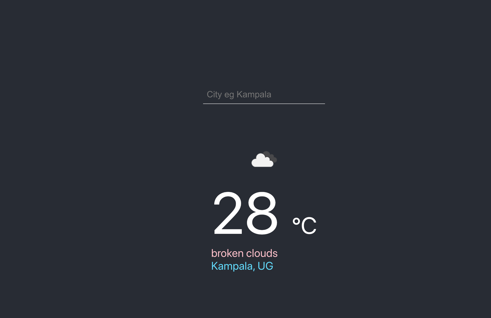

## Demo
Simple backend and ui to demo multistage builds for the first session of the containers study group!

Additionally, there are also instructions on how to deploy the images built here to a kubernetes cluster. Find these instructions [here](deployment/readme.md)

## Stack
- [Backend](weather_api/README.md) - Elixir/Phoenix
- [Frontend](fe/README.md) - ReactJS

## Requirements
- Docker (> v17.05)

## Setup Instructions
 - Create a new `.env.local` file
 - copy the contents of [.env.local.example](weather_api/.env.local.example) files to the new `.env.local` file created in the step above. This file contains your apikey that you should generate from  and secret for the api.
- Generate an api key from [openweather api](https://openweathermap.org/appid). Set it as a value for `OPEN_WEATHER_API_KEY` and you can also replace the `SECRET_KEY_BASE`. 

## Run
- Run the slimmer version with `make run`
- Run the development version with `make run-dev`

General docker instructions can be got from respective [backend](weather_api/README.md) and [frontend](fe/README.md) README files. 

#

